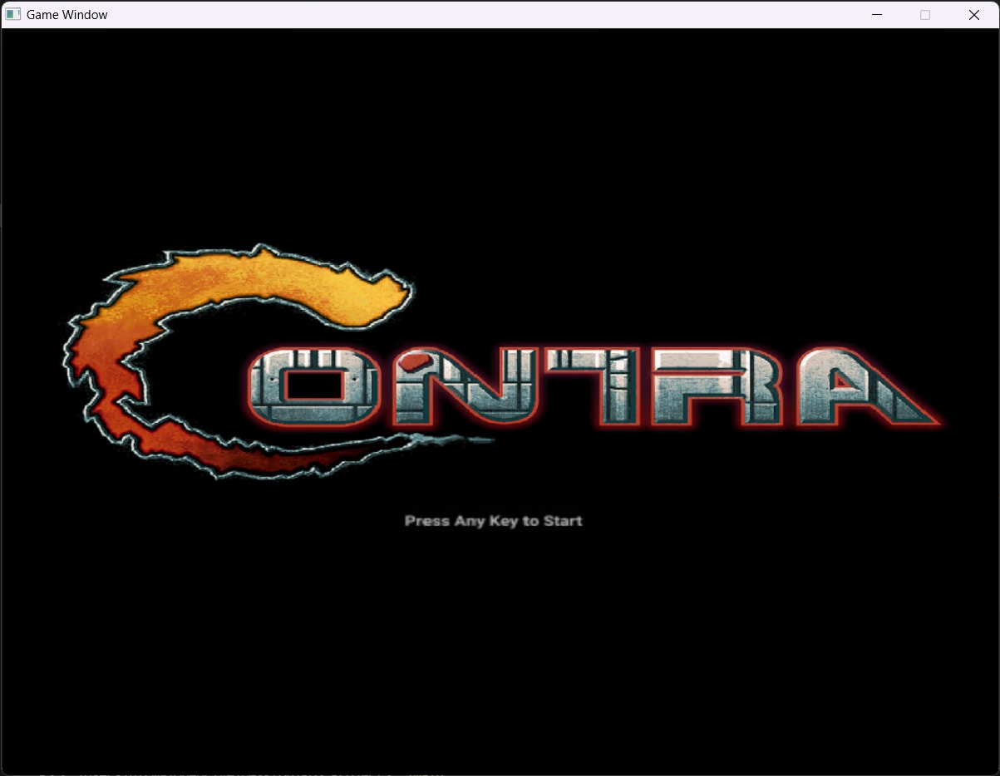
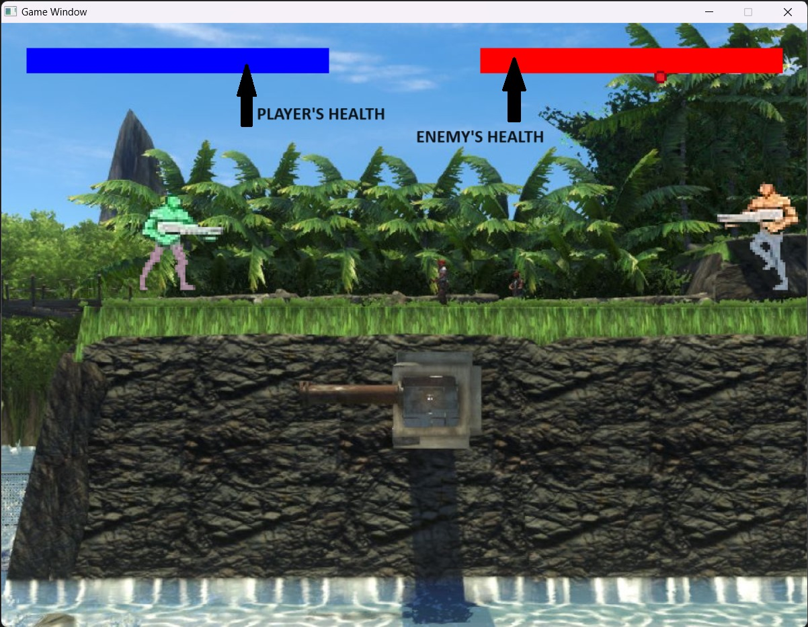

<!DOCTYPE html>
<html lang="en">
<head>
    <meta charset="UTF-8">
    <meta name="viewport" content="width=device-width, initial-scale=1.0">
</head>
<body>
    <h1 class="heading1">Contra PDS Project</h1>
    <h2 class="heading2">INTRODUCTION</h2>
    

        Our team has created a game design in which we have tried to recreate one of our childhood's favourite memory Contra. The following project required various concepts of C-language and SDL library. Through this project we have made an attempt to try something new which required learning a new concept that could help us in future.
    

    <h2 class="heading2">GROUP MEMBERS</h2>
    <ol>
        <li>Nirmay Nandurkar (23MM01016)</li>
        <li>Ansh Gupta (23MM02002)</li>
        <li>Archit Sharma (23MM02003)</li>
        <li>Utkarsh Malhotra (23MM01025)</li>
    </ol>
    <h2 class="heading2">FEATURES</h2>
    

        <ol>
            <li><h3 class="heading3">Sound Effects</h3>
                

                    The code utilizes SDL_mixer library to incorporate sound effects into a game. 
                

            </li>
            <li><h3 class="heading3">Bullets</h3>
                

                    The game features a bullet system where the player can shoot bullets using the spacebar key. 
                

            </li>
            <li><h3 class="heading3">Health Bar</h3>
                

                    Health bars are employed to visually represent the health status of both player and enemy characters.
                

            </li>
            <li><h3 class="heading3">Keyboard bindings</h3>
                

                    Specific keys are assigned to different game actions, like arrow keys for movement and spacebar for shooting.
                

            </li>
            <li><h3 class="heading3">Start and End screens</h3>
                

                    The start screen prompts players to begin the game, while end screens appear upon winning or losing, allowing players to exit or start a new session.
                

            </li>
            <li><h3 class="heading3">Enemy Character</h3>
                

                    Its behavior is governed by game logic, providing an interactive challenge for players to overcome.
                

            </li>
        </ol>
    

    <h2 class="heading2">References</h2>
    

        <a href="https://www.101soundboards.com/boards/10679-contra-sounds">Sound Effects</a>
    

    <h2 class="heading2">Screenshots</h2>
    

    
    
    

</body>
</html>
